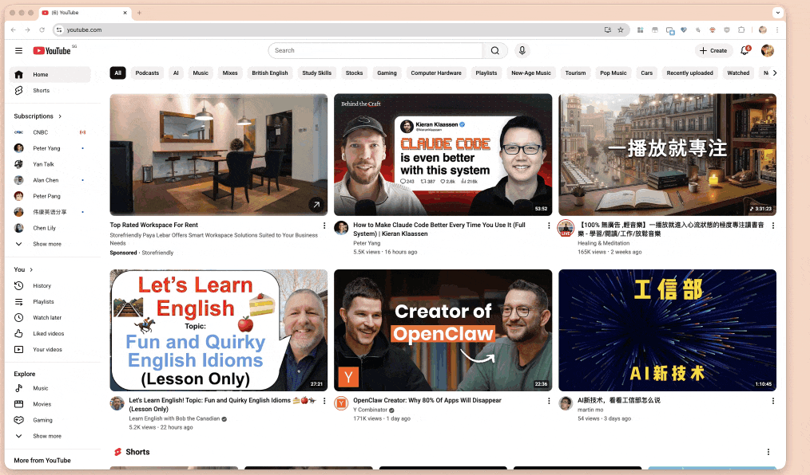

在新版本的 Chrome（以及基于 Chromium 的其他浏览器）中，uBlock Origin (uBO) 无法正常运行的核心原因是谷歌在扩展程序架构上强制推行了 Manifest V3 (MV3) 标准，并弃用了旧版的 Manifest V2 (MV2)。在 Manifest V2 时代，uBlock Origin 使用的是 webRequest API。

MV2 (旧模式)： 浏览器每发起一个请求，扩展程序都能“拦截”并决定是否允许。这使得 uBO 可以进行复杂的逻辑判断、动态过滤和正则匹配。

MV3 (新模式)： 谷歌为了“性能”和“隐私”理由（官方说法），引入了 declarativeNetRequest API。现在扩展程序不能实时拦截请求，必须预先向浏览器提交一份“静态过滤规则表”，由浏览器代为执行。这种改变剥夺了扩展程序的决策权，使得 uBO 标志性的“高级动态过滤”和实时脚本注入功能受到极大限制。

谷歌的弃用计划在 2024 年至 2025 年间分阶段执行：2024 年下半年： Chrome 开始在开发者版本中禁用 MV2。2025 年： 逐步在稳定版中停用，并强制下架不合规的插件。2026 年（当前）： MV2 支持已基本全面终结。原本可以用来“续命”的企业组策略 ExtensionManifestV2Availability 通常也已到期（大部分在 2025 年 6 月之后失效）。

如果你需要继续获得强大的广告拦截体验，安装 uBlock Origin Lite (uBOL)，这是原作者 Raymond Hill (gorhill) 专门为 MV3 架构开发的精简版。 符合 Chrome 新标准，无需特殊配置。过滤能力不如原版（尤其是 YouTube 的对抗和脚本过滤），不支持自定义复杂的规则。

## 使用效果自动清理youtube 排名第一的赞助视频

## 《uBlock Origin Lite》 下载链接

<table style="table-layout: fixed;">
<tbody>
<tr>
<td>

Chrome
 

</td>
<td>

Edge
 

</td>
<td>

FireFox
 

</td>
<td>

离线安装包
 

</td>
</tr>
<tr>
<td>

<a  href="https://chromewebstore.google.com/detail/ublock-origin-lite/ddkjiahejlhfcafbddmgiahcphecmpfh">下载链接 / Download link</a>

</td>
<td>

<a  href="https://microsoftedge.microsoft.com/addons/detail/ublock-origin-lite/cimighlppcgcoapaliogpjjdehbnofhn">下载链接 / Download link</a>

</td>
<td>

暂无

</td>
<td>

<a  href="https://cdn.jsdelivr.net/gh/zhaoolee/ChromeAppHeroes/backup/131-u-block-origin-lite.zip">下载链接 / Download link</a>

</td>
</tbody>
</table>

## 小结

Google归根到底是一家广告公司，过滤广告这类扩展工具动了Google的蛋糕，于是ublock不得不阉割功能，在Chrome提供不那么好的去广告体验。

如果你希望保留完整的 uBlock Origin 功能，Chromium 内核已不再是最佳选择：Firefox： 它是目前唯一明确表示会长期支持 MV2 关键特性的主流浏览器。在 Firefox 上，uBO 依然拥有“完全体”权限。Brave： 它是基于 Chromium 的浏览器，但它在浏览器内核底层（C++ 级别）集成了原生广告拦截器，不依赖扩展程序的 API，因此其拦截效果目前依然优于 Chrome。

## 写在最后(我需要你的支持) / At the end (I need your support)

- 本文属于**Chrome插件英雄榜** 项目的一部分, 项目Github地址: [https://github.com/zhaoolee/ChromeAppHeroes](https://github.com/zhaoolee/ChromeAppHeroes)

- This article is part of the **ChromeAppHeroes** project. Github link : [https://github.com/zhaoolee/ChromeAppHeroes](https://github.com/zhaoolee/ChromeAppHeroes) 

- **Chrome插件英雄榜**, 为优秀的Chrome插件写一本中文说明书, 让Chrome插件英雄们造福人类, 如果你喜欢这个项目, 希望你能为本项目添加一颗 🌟星.

- ChromeAppHeroes, Write a Chinese manual for the excellent Chrome plugin, let the Chrome plugin heroes benefit the human, If you like this project, I hope you can add a star 🌟 to this project.
